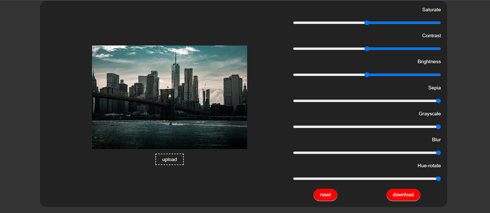

<h1 align="center">
🖼️ Image Editor
</h1>

<p align="center">
A lightweight browser-based image editor built with vanilla JavaScript that allows users to apply real-time image adjustments and visual effects directly in the browser using native CSS filter functions.
</p>

<p align="center">


</p>

---

# 📖 Overview

Image Editor is a browser-based image editing application developed using HTML, CSS, and vanilla JavaScript.

The application applies image adjustments in real time using native CSS filter functions, allowing users to upload images, preview visual changes instantly, reset edits, and download the final result without relying on external libraries or backend services.

---

# ✨ Features

| Feature | Description |
|----------|-------------|
| 📤 Image Upload | Import images from the local device |
| 🎨 Real-Time Editing | Apply visual adjustments with instant preview |
| ☀ Brightness | Adjust image brightness |
| 🌗 Contrast | Modify image contrast |
| 🌈 Saturation | Control color intensity |
| ⚫ Grayscale | Convert images to grayscale |
| 🟤 Sepia | Apply vintage-style effect |
| 🌫 Blur | Blur the image |
| 🎭 Hue Rotation | Rotate image colors |
| 🔄 Reset | Restore the original image |
| 💾 Export | Download the edited image |

---

# 🏗 Processing Flow

```text
User Uploads Image

        │

        ▼

Preview Image

        │

        ▼

Apply CSS Filter Functions

        │

        ▼

Live Preview

        │

        ▼

Download Edited Image
```

---

# ⚙ Technologies Used

- HTML5

- CSS3

- JavaScript (ES6)

- CSS Filter Functions

- File API

---

# 📂 Project Structure

```text
project/

 index.html

 style.css

 script.js

 screenshots/
```

---

# 🚀 Installation

Clone the repository

```bash
git clone https://github.com/tamerayman/Image-Editor.git
```

Open the project

```text
index.html
```

Upload an image, apply the desired filters, then download the edited result.

---

# 📸 Screenshots

## 🖼️ Image Editor



---

# 💡 What This Project Demonstrates

- DOM Manipulation
- JavaScript Event Handling
- CSS Filter Functions
- File Handling
- Real-Time UI Updates
- Responsive UI Design
- Client-Side Web Application Development

---

# 📈 Project Status

| Module | Status |
|---------|--------|
| Image Upload | ✅ Completed |
| Live Filters | ✅ Completed |
| Image Download | ✅ Completed |
| Reset Changes | ✅ Completed |

---

# 📄 License

This project is licensed under the MIT License.

---

<p align="center">

Developed with ❤️ by <strong>Tamer Ayman</strong>

</p>
